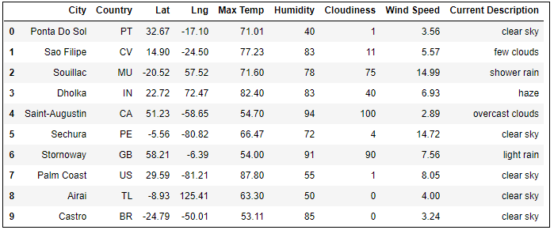
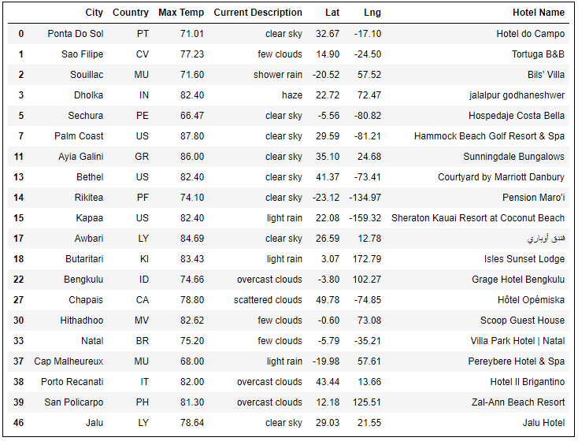
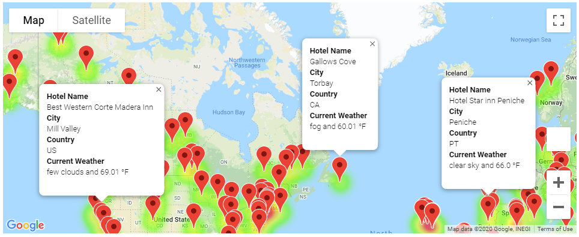
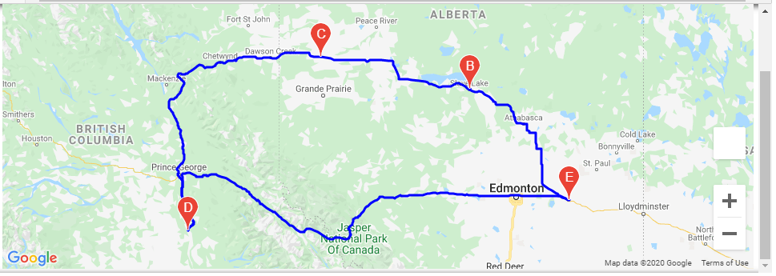
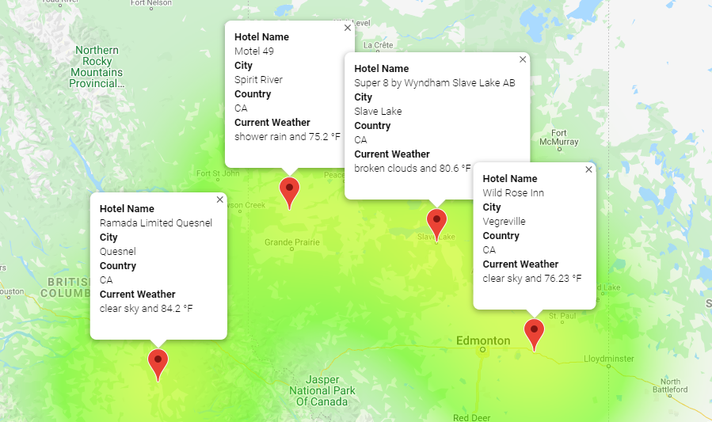

# World Weather Analysis

## Project Overview

I will be helping Jack, the head of Analysis for the User Interface team, at ***PlanMyTrip***, a top travel tech company that specializez in internet related services in the hotel and lodging indistry. 

Jack has asked me help him collect and present data for customers via the search page which they then filter based on their preferred travel criteria in order to find their ideal hotel anywhere in the world.

## Purpose of this Assignment
Jack loved the PlanMyTrip app that I created. Beta testers loved it too. And, as with any new product, they’ve recommended a few changes to take the app to the next level. 

1) They recommended adding the weather description to the weather data.

2) I'll have the beta testers use input statements to filter the data for their weather preferences, which will be used to identify potential travel destinations and nearby hotels. 

3) From the list of potential travel destinations, the beta tester will choose four cities to create a travel itinerary. Finally, using the Google Maps Directions API, you will create a travel route between the four cities as well as a marker layer map.

## Assignment Results

1) In the new version, the count of random latitudes and longitudes was incresed from 1,500 to 2,000. Current weather description was also added to the output.

    **Image 1 (below): Output of cities with a column for 'Current Description'**
    

2) Values for temperatures entered by beta testers

    What is the minimum temperature you would like for your trip? ***65***

    What is the maximum temperature you would like for your trip? ***90***

    **Image 2 (below): Hotels in cities meeting the temperature criteria**
    

    **Image 3 (below): Markers and descriptions of all hotels meeting the criteria on Google Maps**

    

3) Four cities chosen by the beta testers
    * Vegreville, Canada
    * Slave Lake, Canada
    * Spirit River, Canada
    * Quesnel, Canada 

    **Image 4 (below): Travel route between the 4 selected cities**

    

    **Image 5 (below): Selected hotesl with markers and descriptions**

    